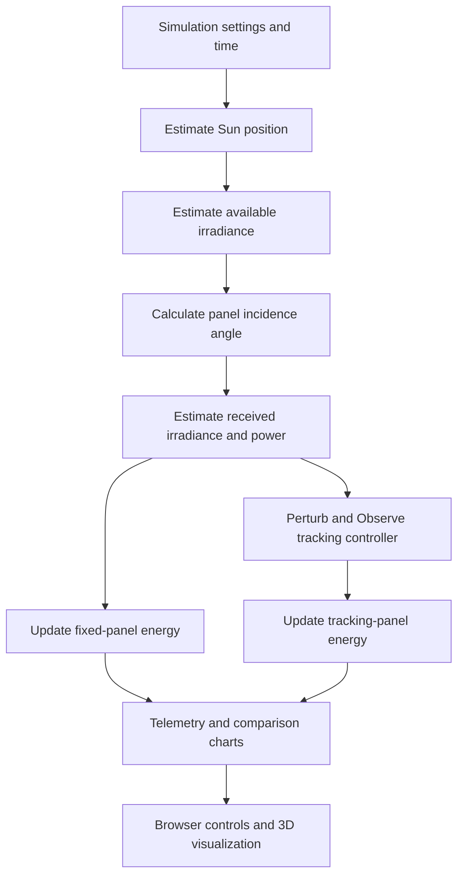
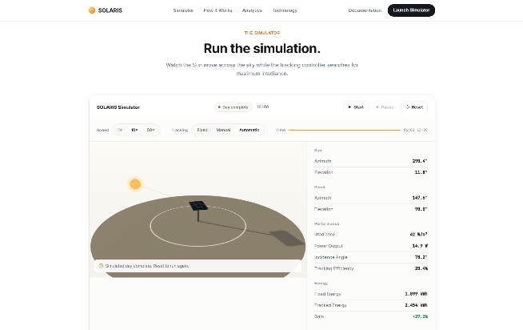
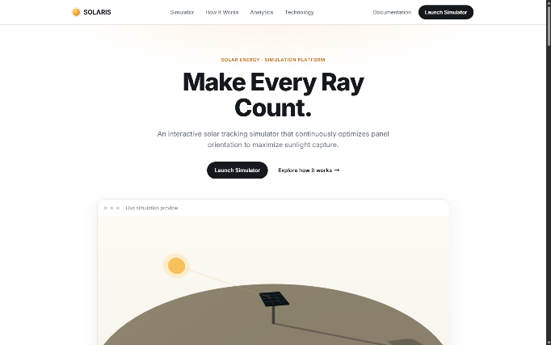
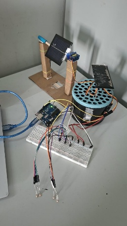
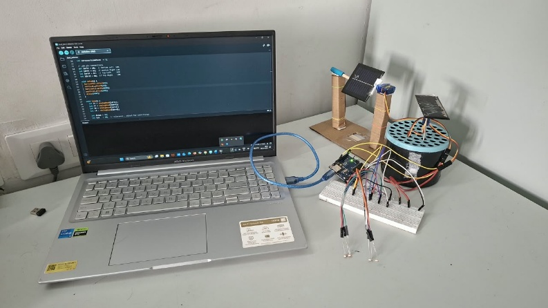
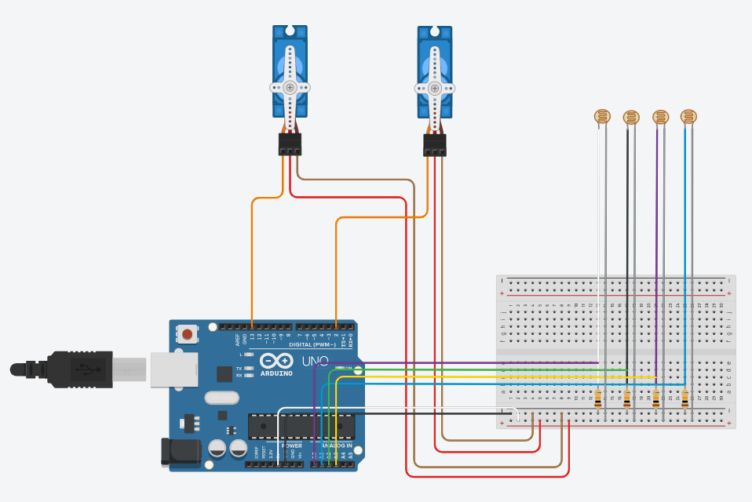

# SOLARIS — Intelligent Solar Tracking & Optimization

SOLARIS is a student project that explores how solar-panel orientation affects energy capture. It combines an interactive, browser-based solar-tracking simulator with an Arduino-based dual-axis light-tracking prototype.

The software simulator models the Sun's movement over a simulated day, estimates irradiance and energy, and compares a fixed panel with a simulated tracking panel. The hardware prototype uses light-dependent resistors (LDRs) and servo motors to adjust a panel's orientation in response to differences in measured light.

> **Important:** The simulator and Arduino prototype are separate implementations in this repository. The current project code does not implement a direct communication link between the web application and the physical tracker. Simulator results are estimates from a simplified model, not measured real-world performance.

## Contents

- [Project highlights](#project-highlights)
- [Project components](#project-components)
- [Technology stack](#technology-stack)
- [Repository structure](#repository-structure)
- [Run the web simulator](#run-the-web-simulator)
- [Run the Arduino prototype](#run-the-arduino-prototype)
- [How the simulator works](#how-the-simulator-works)
- [API overview](#api-overview)
- [Model and assumptions](#model-and-assumptions)
- [Screenshots](#screenshots)
- [Testing and validation](#testing-and-validation)
- [Limitations and future work](#limitations-and-future-work)
- [Team](#team)

## Project highlights

- Simulated daytime tracking from **06:00 to 18:00**.
- Three operating modes: **Fixed**, **Manual**, and **Automatic**.
- Interactive 3D visualization of the Sun and solar panel.
- Live telemetry and charts for comparing fixed and tracking configurations.
- Configurable parameters, including latitude, day, panel tilt/orientation, area, and efficiency.
- A software-based **Perturb and Observe (P&O)** tracking controller.
- A separate Arduino dual-axis prototype using four LDR inputs and two servo motors.

## Project components

### 1. Software — solar-tracking simulator

The web application estimates solar position, available and received irradiance, panel power, and accumulated energy. It runs a fixed-panel model alongside a simulated tracking panel so their outputs can be compared under the same simulation settings.

The application uses a client-server structure: the Express backend runs the simulation and exposes REST endpoints, while the browser interface presents controls, telemetry, charts, and the 3D scene.

### 2. Hardware — dual-axis light-tracking prototype

The Arduino sketch reads four LDR channels, compares average light levels across the left/right and top/bottom sides, and adjusts two servo positions when the differences exceed a tolerance.

**Hardware listed in the project report:**

- Arduino Uno or compatible Arduino board
- Four photoresistors (LDRs)
- Four 10 kΩ resistors for voltage-divider circuits
- Two servo motors
- Breadboard and jumper wires
- Suitable 5 V power supply/battery pack
- Solar panel and mechanical mounts/frame
- Arduino USB cable
- Optional 3D-printed mechanical parts

Check the actual components and wiring of your build before reproducing it. Servos may require a separate supply capable of providing their current demand; use a common ground where required. Do not power servos directly from an Arduino I/O pin.

## Technology stack

| Area | Technologies |
|---|---|
| Backend | Node.js 18+, Express.js |
| Templates | EJS |
| Frontend | HTML5, CSS3, vanilla JavaScript |
| UI and icons | Bootstrap 5, Bootstrap Icons |
| 3D visualization | Three.js |
| Charts | HTML5 Canvas |
| Hardware firmware | Arduino C/C++ and the Arduino Servo library |
| Data storage | No database; simulator state is held in memory |

## Repository structure

The following is the intended top-level structure when the repository is uploaded to GitHub. `node_modules/` is generated locally by npm and should not be committed.

```text
.
├── README.md
├── dual_axis/
│   └── dual_axis.ino
├── prototype_images/
│   ├── circuit-diagram.png
│   ├── hardware-prototype-1.jpeg
│   ├── hardware-prototype-2.jpeg
│   ├── simulator-screenshot-1.png
│   └── simulator-screenshot-2.png
├── solaris/
│   ├── package.json
│   ├── package-lock.json
│   ├── server.js
│   ├── controllers/
│   │   ├── configurationController.js
│   │   └── simulationController.js
│   ├── routes/
│   │   ├── apiRoutes.js
│   │   └── pageRoutes.js
│   ├── services/
│   │   └── simulationService.js
│   ├── simulation/
│   │   ├── energyModel.js
│   │   ├── irradiance.js
│   │   ├── panelPhysics.js
│   │   ├── simulationEngine.js
│   │   ├── solarPosition.js
│   │   └── trackingController.js
│   ├── views/
│   │   ├── index.ejs
│   │   └── partials/
│   └── public/
│       ├── css/
│       └── js/
└── SOLARIS.pptx
```

The exact files in your final repository may differ slightly as the project evolves. Keep the README paths aligned with the folders and files actually pushed to GitHub.

## Run the web simulator

### Prerequisites

- [Node.js](https://nodejs.org/) version 18 or later
- npm (included with Node.js)
- A modern browser such as Chrome, Edge, or Firefox
- Internet access for externally hosted frontend assets, if applicable

### Setup

1. Clone your GitHub repository and enter the software directory:

   ```bash
   git clone <YOUR-GITHUB-REPOSITORY-URL>
   cd <YOUR-REPOSITORY-FOLDER>/solaris
   ```

   Replace the placeholders with your repository URL and folder name. If you already downloaded the project, simply open a terminal in its `solaris/` directory.

2. Install dependencies:

   ```bash
   npm install
   ```

3. Start the development server:

   ```bash
   npm run dev
   ```

   Or run without automatic restarts:

   ```bash
   npm start
   ```

4. Open [http://localhost:3000](http://localhost:3000) in your browser.

The application uses port `3000` by default. If you change the port, set the `PORT` environment variable in the environment where the server is started.

### Stop the server

In the terminal running the server, press `Ctrl+C`.


[Live Demo](https://solaris-ashen.vercel.app/)

## Run the Arduino prototype

1. Install and open the [Arduino IDE](https://www.arduino.cc/en/software/).
2. Open `dual_axis/dual_axis.ino`.
3. Connect the board, LDR voltage-divider circuits, and servo signal wires according to your actual circuit.
4. Select the correct board and serial port in the IDE.
5. Compile the sketch and upload it to the board.
6. Test the movement with the mechanism securely mounted and the servo power supply appropriate for the motors.

### Pin mapping in the supplied sketch

| Component | Pin in sketch |
|---|---|
| Bottom-left LDR | `A0` |
| Top-left LDR | `A1` |
| Top-right LDR | `A2` |
| Bottom-right LDR | `A3` |
| Horizontal servo signal | `D2` |
| Vertical servo signal | `D13` |

The sketch uses the Arduino `Servo` library. The LDR inputs need suitable sensor circuitry—commonly voltage dividers—so that the analog pins can measure a changing voltage. Confirm sensor orientation and motor direction experimentally, because the required direction can depend on how the sensors and servos are mounted.

## How the simulator works



At a high level, the simulation:

1. Estimates the Sun's azimuth and elevation from the configured location, day, and time.
2. Estimates available sunlight using a simplified clear-sky model.
3. Uses the angle between the Sun direction and the panel surface normal to estimate received irradiance.
4. Estimates panel power and integrates it over the simulated time to calculate energy.
5. Uses the P&O controller in Automatic mode to perturb panel orientation and respond to changes in estimated output.
6. Displays the simulation state and compares fixed and tracking results.

## API overview

The simulator exposes these REST endpoints:

| Method | Endpoint | Purpose |
|---|---|---|
| `GET` | `/api/health` | Service health check |
| `GET` | `/api/config` | Read simulation configuration |
| `GET` | `/api/simulation/state` | Read current simulation state |
| `GET` | `/api/simulation/results` | Read simulation history and energy comparison |
| `POST` | `/api/simulation/start` | Start or resume the simulation |
| `POST` | `/api/simulation/pause` | Pause the simulation |
| `POST` | `/api/simulation/reset` | Reset simulation state |
| `POST` | `/api/simulation/step` | Advance one simulation step |
| `POST` | `/api/simulation/config` | Update supported simulation parameters |
| `POST` | `/api/simulation/speed` | Set simulation speed (`1`, `10`, or `50`) |
| `POST` | `/api/tracking/mode` | Select `fixed`, `manual`, or `automatic` mode |
| `POST` | `/api/panel/orientation` | Set manual panel azimuth and elevation |

## Model and assumptions

The simulator uses simplified relationships such as:

\[
I_{\text{received}} = I_{\text{sun}} \times \max(0,\cos\theta)
\]

\[
P = I_{\text{received}} \times A \times \eta
\]

where:

- \(I_{\text{sun}}\) is the estimated available irradiance.
- \(I_{\text{received}}\) is the estimated irradiance received by the panel.
- \(\theta\) is the angle of incidence between the incoming sunlight direction and the panel surface normal.
- \(A\) is the configured panel area.
- \(\eta\) is the configured panel conversion efficiency.
- \(P\) is estimated electrical power.

The model is intended for education and experimentation. It does not fully model real weather, clouds, shading, dust, temperature effects, inverter and wiring losses, or energy consumed by tracking motors. Results depend on the chosen model and parameters.

> **Interpretation of results:** The project report records approximately 29% higher *simulated* energy capture for the tracking panel under its default summer-day configuration. This is a simulation result, not a validated real-world efficiency gain or a measurement from the physical prototype.

## Screenshots

The repository includes example images in `prototype_images/`.

### Simulator





### Hardware prototype





### Circuit diagram



If you rename or move any image, update the corresponding relative path above. GitHub displays these images directly in the README when the paths match the repository.

## Testing and validation

The project report records software checks for changing latitude, changing panel tilt, Fixed mode, Automatic mode, and comparing fixed/tracking simulated energy. It marks these software test cases as passed.

For a fresh clone or future release, repeat the checks and record the actual outcome:

- [ ] Dependencies install successfully with `npm install`.
- [ ] The server starts with `npm run dev` or `npm start`.
- [ ] The home page and `/api/health` load successfully.
- [ ] Start, pause, reset, and simulation-speed controls behave as expected.
- [ ] Fixed, Manual, and Automatic modes behave as expected.
- [ ] The 3D scene, telemetry, and charts update during simulation.
- [ ] The Arduino sketch compiles for the selected board.
- [ ] Both servo axes respond safely to changes in light level.
- [ ] Sensor readings and movement direction are checked against the assembled hardware.

A checked item should mean it was tested in the current environment; do not treat the checklist itself as evidence of a successful test.

## Limitations and future work

- Incorporate real weather and irradiance data.
- Add GPS-based location detection and more detailed solar-position modelling.
- Include cloud cover, shading, temperature, dust, and practical system losses.
- Measure the physical prototype under controlled lighting and outdoor conditions.
- Improve the mechanical mount and validate sensor alignment and servo limits.
- Explore ESP32-based control and a defined communication interface between the simulator and hardware.
- Investigate machine-learning-based optimization and a hardware-connected solar digital twin.

## Team

**Project:** SOLARIS — Intelligent Solar Panel Mechanism  
**Team:** Group 61  
**Project guide:** Dr. Vikas Panthi  
**Institution:** VIT Bhopal University, School of Computing Science and Engineering

| Team member | Project ID | Contribution (as described by the team) |
|---|---|---|
| Dhruv Prasad Warrier | 25BCE10476 | Project idea, hardware prototype design, and initial software work |
| Suyash Avatar | 25BCE10367 | Hardware structure and software contributions |
| Aryan Kundu | 25BCE11217 | Research and software |
| Piyush | 25BCE10260 | Documentation and presentation |
| Vaibhav Sharma | 25BCE11300 | Documentation and presentation |

## Acknowledgement

Developed as an academic project at VIT Bhopal University. The team acknowledges the guidance and support of Dr. Vikas Panthi and the School of Computing Science and Engineering.

---

If you use, modify, or extend this project, please describe the changes and distinguish simulated results from measurements obtained from real hardware.
